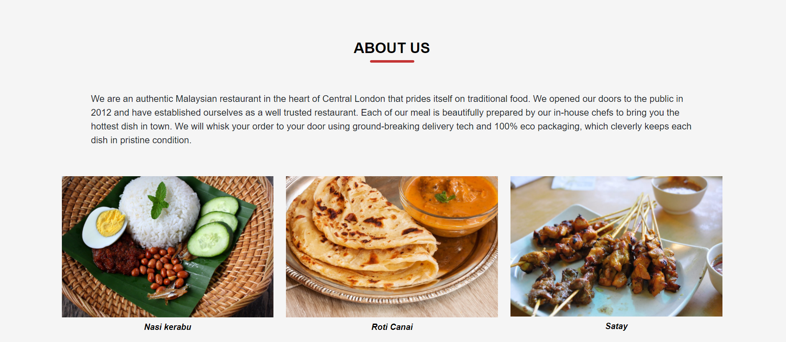

<h1 align="center">Mayas House Restaurant Website</h1>

This is the main website for Mayas house restaurant. It is designed to be responsive and accessible on multiple devices, making it easy to navigate for new and existing visitors.

[visit website here](https://mattb859.github.io/Ms1-Malaysian-Restaurant/)

## User Experience (UX)

-   ### User stories

    -   ### First Time Visitor Goals

        1. As a First Time Visitor, I want to easily understand the main purpose of the site and learn more about the restaurant.
        2. As a First Time Visitor, I want to easily navigate throught the site to   find information.
        3. As a First Time Visitor, I want to look for eye catching pictures.
        4. As a First Time Visitor, I want the website and content to load fast.
        5. As a First Time Visitor, I want to look for testimonials to see what other customer have felt about their services and to see if they are trusted, I also want to locate any social media links to see their followings.

    -   ### Returning Visitor Goals 

        1. As a Returning Visitor, I want to find the best way to get in contact with the restaurant for any questions I may have. 
        2. As a Returning Visitor, I want to see if there are any new updated information that i may find useful.
        3. As a Returning Visitor, I want to find information on how to locate the restaurant. 

    -   ### Frequent User Goals

        1. As a Frequent User, I want to sign up to the Newsletter so that I am emailed any major updates and/or changes to the website.
        2. As a Frequent User, I want to see if there are any updated information.
        3. As a Frequent User, I want to see if there are any new added pictures. 

-   ### Website Design 

    -   ### Home Page

        1. For the home page Imagery is very important. The large background hero image is designed to capture the visitor's attention with its beautiful presentation of the food served in the restaurant.

        2. On the left of the image is some text which gives a warm inviting message.

        3. Below the main text there is a call to action button when clicked opens a modal box which allows new customers to sign up to the website's newsletter.
       
        

    -   ### Navigation bar

        1. When entering the website, users are instantly greeted with a clean and easy to read navigation bar to go to the page of their choice.

        2. For mobile and tablet view there is a hamburger icon which will collapses once clicked on to display the navbar menu.

         

    -   ### About Us

        1. Here users will find information about our restaurant's history, core values, beliefs and the services we provide for each of our diners.
        
        

        
        

    -   ### Our Chefs

        1. Visitors can find information about our trained professional Chefs. It is important to know who will be preparing your food and the level of expertise they have, this builds trust with our diners.

        2. On the right you will find an image of our chefs.

        3. To the left you can find information about our chefs.

        4. The backgrounds colour is an earthy green which represents health and nature.

        

         
        

    -   ### Testimonials

        1. Here visitors can find reviews from our satisfied diners and the experience they have had while eating at our restaurant.

        

        
        

    -   ###   Mobile View

        2. This is the layout for mobile and tablet devices when displayed vertically.

        

        
        

    -   ### Contact Us

        1. This is the contact section it opens up in a completely separate page.

        

         
        
   
    
    -   ### Find Us

        1. Here visitors can find the opening hours of the restaurant and a
        location.
        
        

        
        

    -   ### Footer
        
        1. On the footer of the website the user can find all our social media links, when clicked a separate page will open up where users can follow us.
        
        

        
        
 

    -   ### Colour Scheme
        -    The main colours used for the site are Crimson, white, Black, and Dark Green.

    -   ### Typography
        -    The Merienda font is used for the home page text it adds an authentic feel to the website with Sans Serif for the rest of the websites font.
    
    -   ### Wireframes

    -   Home Page Wireframe - [View](https://balsamiq.cloud/seqremb/ppq8zy/r0742)
    -   Mobile Wireframe - [View](https://balsamiq.cloud/seqremb/ppq8zy/r2278)
    -   Tablet Wireframe - [View](https://balsamiq.cloud/seqremb/ppq8zy/rCA01) 

-   ## Features

    -   ### Current Features

        1. This is a two page website with 5 sections for the first page and a contact section for the second page.

        2. All pages are fully responsive on all devices.

    -   ###  Future Features

        1. To add an online booking system that allows customers to book a table reservation.

        2. To add a photo gallery carousel.

        3. To add a food and drinks menu page.    

## Technologies Used

-   ### Languages Used

    -   [HTML5](https://en.wikipedia.org/wiki/HTML5)
    -   [CSS3](https://en.wikipedia.org/wiki/CSS)

    ### Frameworks, Libraries & Programs Used

    1. [Bootstrap 5.0.2:](https://getbootstrap.com/docs/5.0/getting-started/download/) 
    - Bootstrap was used to assist with the styling and responsiveness of the website.
    1. [Hover.css:](https://www.w3schools.com/cssref/sel_hover.asp) 
    -  Hover.css was used on the navigation bar and on all social media links in the footer to add a floating colour change when hovering over the links.
    1. [Google Fonts:](https://fonts.google.com/)
    -  Google fonts were used to import 'Merienda' 'Volkhov' and 'Open Sans' font as a link in the html page header which is used on all pages throughout the website.
    1. [Font Awesome:](https://fontawesome.com/) 
    - Font Awesome was used on the location section of the website to add aesthetic and UX purposes.
    1. [JQuery:](https://jquery.com/)
    - JQuery came with Bootstrap to toggle the navbar when using mobile and tablet devices.
    1. [Animate.css](https://animate.style/)
    -  Animate.css was used to fade in left the home page "text" and the call to action "sign up" button. It adds aesthetic and UX purposes.  
    1. [Git:](https://git-scm.com/)
    -  Git was used for version control by utilizing the Gitpod terminal to commit to Git and Puch to GitHub.
    1. [GitHub:](https://github.com/)
    -  GitHub is used to store project codes after being pushed from the Gitpod terminal.
    1. [Affinity Designer:](https://affinity.serif.com/en-gb/designer/)
    -  Affinity Designer was used to create the hero background image for the website.
    1. [Balsamiq:](https://balsamiq.com/)
    - Balsamiq was used to create the wireframes during the design process.

## Testing
    
-   ### Validator Testing    

    - The W3C Markup Validator and W3C CSS Validator Services were used to validate every page of the project to ensure there were no syntax errors in the project.

-   ### HTML5 

    -  [W3C Markup Validator](https://validator.w3.org/#validate_by_input+with_options)

        

         
        

-   ### CSS3

    -  [W3C CSS Markup Validator](https://jigsaw.w3.org/css-validator/#validate_by_input)

        

         
        

        
    -   ###  All pages came back with no errors.

## Testing User Stories from User Experience (UX) Section

-   ### First Time Visitor Goals

    1. As a First Time Visitor, I want to easily understand the main purpose of the site and learn more about the restaurant.

        1. When entering the website, users are instantly greeted with a clean and easy to read navigation bar to go to the page of their choice. Underneath there is a Hero Image with text and a "Sign Up" call to action button which opens a "modal" for visitors to sign up using an email address and password.

        2. The Hero Image and text immediately lets visitors know what the website is all about.

        3. The user has three options, click the call to action button, click the links in the navigation bar or scroll down to learn more about the restaurant.

    2. As a First Time Visitor, I want to easily be able to navigate throughout the site to find content.

        1. The website has been designed to be user-friendly and never to entrap the user. At the top of each page there is a clean navigation bar, each link describes what section of the website or page they will end up on.

        2. At the bottom of the first 3 pages there is a redirection button which navigates back to the top of the page to ensure the user always has somewhere to go and doesn't feel trapped as they get to the bottom of the page.

        3. On the Contact Us Page, after a form response is submitted, the page refreshes and the user is brought back to the main home page. 

    3. As a Returning Visitor, I want to find all social media links so that I can follow the pages and keep up to date with new content posted.

        1.  All social media links can be found at the footer of every page and will open a new tab for the user and more information can be found on the page.

        2. The user can scroll to the bottom of the Home page to find the Instagram, Facebook, Twitter and YouTube icons and with one click will be directed to the social media page which will open in a new tab to ensure they can get back to the website easily.

        3. If the user is on the "Contact" page they will also have access to all social media icons in the footer so they never have to feel restricted on any page.

    -   #### Frequent User Goals

    1. As a Frequent User, I want to check to see if there are any newly added pictures.

        1. The user would already be comfortable with the website layout and can easily navigate with ease.

    2. As a Frequent User, I want to check to see if there are any new updates.

        1. The user would already be comfortable with the website's layout and can easily click any link

    3. As a Frequent User, I want to sign up to the Newsletter so that I am kept informed about any major updates and/or changes to the website or organisation.

        1.  At the bottom of every page their is a footer which its content is consistent throughout all pages.

        2.  To the right hand side of the footer the user can see "Subscribe to our Newsletter" and are prompted to Enter their email address.

        3.  There is a "Submit" button to the right hand side of the input field which is located close to the field and can easily be distinguished.

## Debugging

-   ### Chrome Developer Tools

    -  Chrome Dev Tools was used for inspection of HTML, and CSS. It helped to diagnose problems, and debug issues right in the browers.

-   ### Further Testing

    -   The Website was tested on Google Chrome, Firefox, Microsoft Edge and Safari browsers.

    -   The website was viewed on a variety of devices such as 
        1. Desktop 
        1. Laptop 
        1. Motorola G4 
        1. Galaxy S5/7
        1. Pixel 2
        1. Pixel 2 XL 
        1. iPhone 5/SE 
        1. iPhone 6/7/8/Plus 
        1. iPhone X, 
        1. ipad/Pro.

    -   A large amount of testing was done to ensure that all pages were linking correctly.

    -   Friends and family members were asked to review the site and documentation to point out any bugs and/or user experience issues.

-   ### Known Bugs

    -   On some mobile devices a white gap can be seen to the right, this then disappears once other mobile, or tablet screen sizes are chosen.

    -   When the call to action button on the home page is clicked and the modal box appears links in the navbar shake.

## Deployment

-   ### GitHub Pages

    - The project was deployed to GitHub Pages using the following steps...    
 
    1. Log in to GitHub and locate the [GitHub Repository](https://github.com/)
    2. At the top of the Repository (not top of page), locate the "Settings" Button on the menu.
    - Alternatively Click [Here](https://raw.githubusercontent.com/) for a GIF demonstrating the process starting from Step 2.
    3. Scroll down the Settings page until you locate the "GitHub Pages" Section.
    4. Under "Source", click the dropdown called "None" and select "Master Branch".
    5. The page will automatically refresh.
    6. Scroll back down through the page to locate the now published site [link](https://github.com) in the "GitHub Pages" section.
  

## Credits

-   ### Code

    - The Code Institute material was the main source of information used to create this project.

    - The Home Page Animation came from [Animate.css](https://animate.style/)

    - Bootstrap Library used throughout the project mainly to make site responsive using the Bootstrap Grid System [Bootstrap](https://getbootstrap.com/docs/4.4/getting-started/introduction/)

-   ### Content

    -  All content was written by the developer.

    -  Psychological properties of colours text in the README.md was found - [here](http://www.colour-affects.co.uk/psychological-properties-of-colours)

    - w3schools was used as a general source of knowledge.

    - Bootstrap for creating a responsive website.

-   ### Media

    -  Hero Image was created by the developer using affinity designer to crop and edit photo on to background [Affinity Designer](https://affinity.serif.com/en-gb/designer/)

    - All Images on the site were sourced from [Pexels](https://www.pexels.com/)

    - photographer - Nicholas Swatz 
    - photographer - Pixabay
  
-   ### Acknowledgements

    - Tutor support at Code Institute for their support.
        